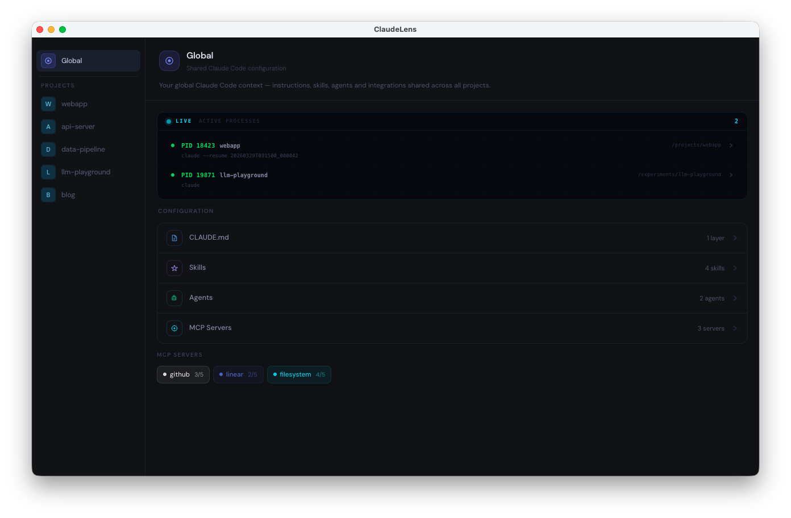
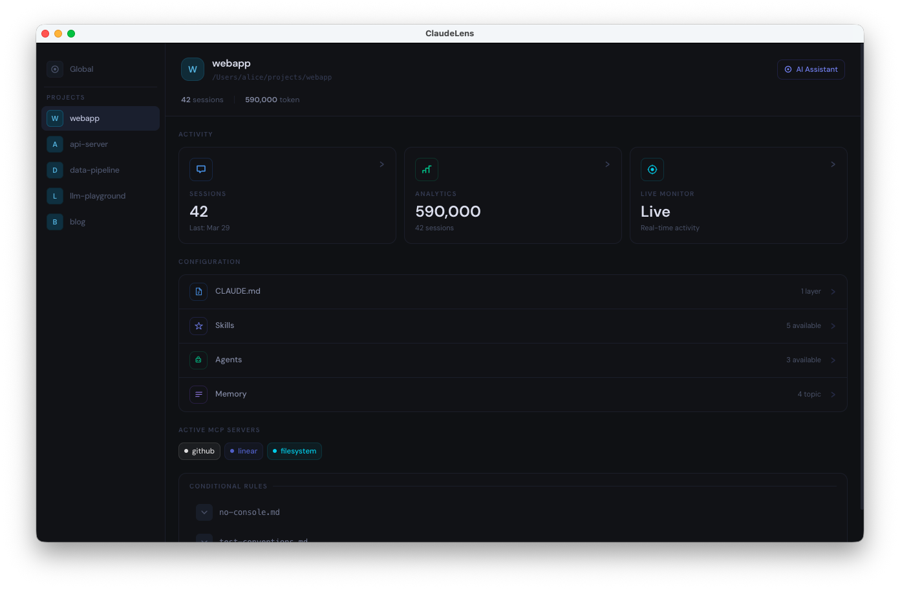
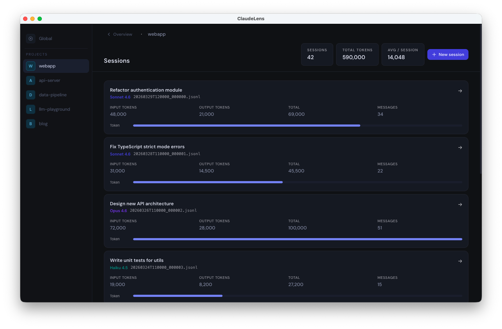
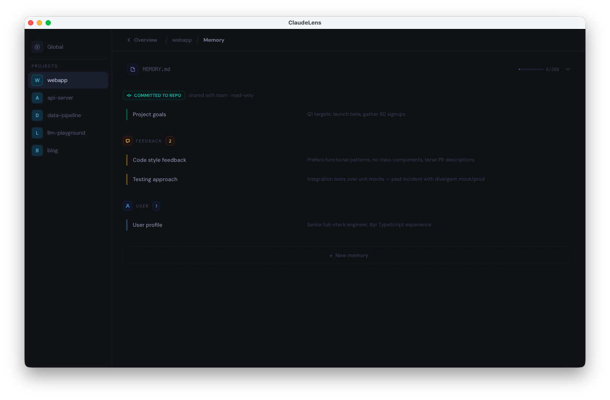
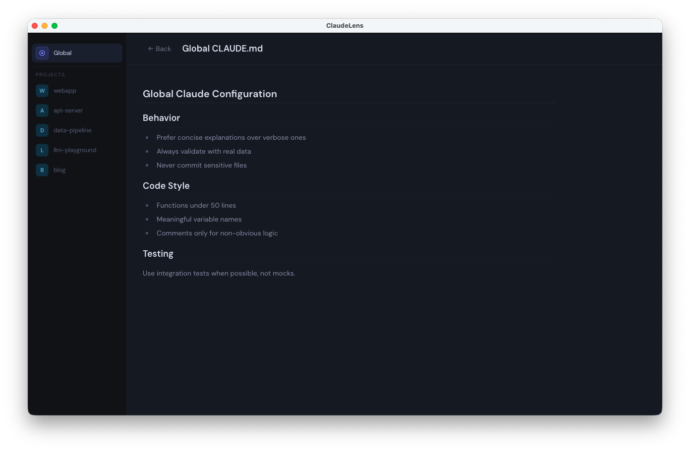
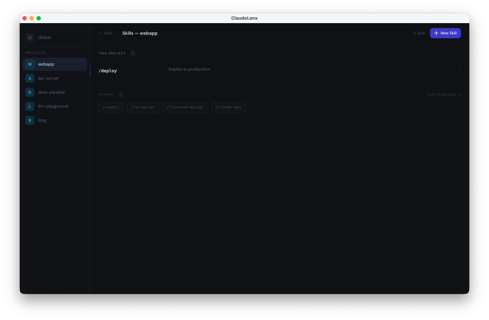
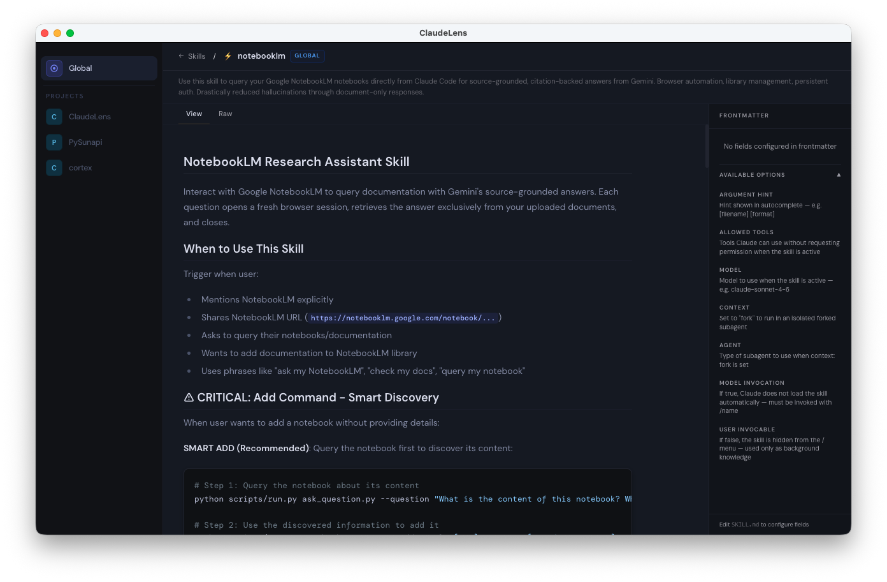
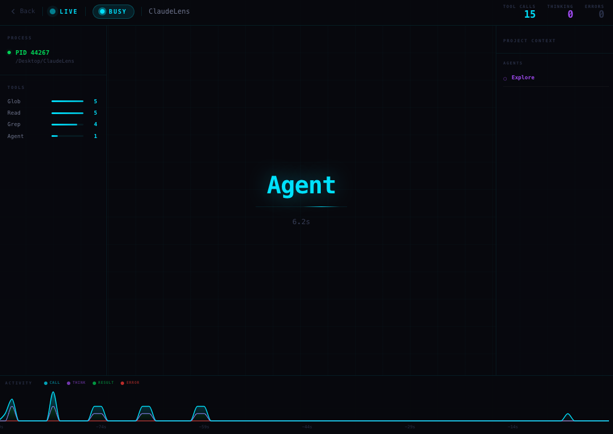

# ClaudeLens

A macOS desktop app to visually explore and manage your local [Claude Code](https://claude.ai/code) data.

If you use Claude Code heavily, you know how opaque `~/.claude/` is — ClaudeLens makes it navigable. Browse chat sessions, manage memory topics, inspect tool calls, view your full CLAUDE.md hierarchy, and monitor active Claude processes, all in one place and updated in real time.

---

## Screenshots



<table>
  <tr>
    <td width="50%">
      
      <br/><sub><b>Project overview</b></sub>
    </td>
    <td width="50%">
      
      <br/><sub><b>Chat sessions</b></sub>
    </td>
  </tr>
  <tr>
    <td width="50%">
      
      <br/><sub><b>Memory management</b></sub>
    </td>
    <td width="50%">
      
      <br/><sub><b>CLAUDE.md — inline file viewer</b></sub>
    </td>
  </tr>
</table>

**Skills and CLAUDE.md include an inline file viewer — click any item to read its full content without leaving the app.**

<table>
  <tr>
    <td width="50%">
      
      <br/><sub><b>Skills — list</b></sub>
    </td>
    <td width="50%">
      
      <br/><sub><b>Skills — file content</b></sub>
    </td>
  </tr>
</table>

**Live Monitor** _(experimental)_ — real-time view of active Claude processes with status badge, 90-second activity chart, and tool frequency breakdown.



---

## Features

### Project overview

The sidebar lists all projects detected in `~/.claude/projects/`. Selecting a project opens a unified view with:

- **Aggregate stats** — total sessions and token usage
- **Recent sessions** — last 4 sessions with date and token count
- **Memory** — all saved topics with type and description
- **CLAUDE.md** — the full instruction hierarchy active for the project
- **Conditional rules** — `.claude/rules/` files with path applicability

Real-time file watcher (chokidar) keeps every view in sync — any change to `~/.claude/` while you work with Claude Code is reflected immediately.

---

### Chat sessions

Browse all conversations of a project, sorted chronologically. Each card shows date, token breakdown, and the dominant model used.

Opening a session reconstructs the conversation from its JSONL file:

- User and assistant messages with timestamps
- Markdown rendering
- Collapsible thinking blocks
- Model distribution across the session
- Strip of tool calls with invocation counts

Two modes: **Minimal** (messages only) and **Full** (includes thinking and tool calls).

---

### Tool call inspector

For each tool call, open a dedicated panel showing input and output with type-specific rendering:

| Tool | Rendering |
|------|-----------|
| **Read** | Filepath + syntax-highlighted code block |
| **Write / Edit** | Filepath + old/new content |
| **Bash** | Description + command in terminal style + output |
| **Grep** | Regex pattern + matching lines with line numbers |
| **Glob** | Pattern + numbered filepath list |
| **Agent** | Agent type + description + markdown response |
| **WebFetch / WebSearch** | URL or query + raw text |

---

### Memory management

Full CRUD interface for Claude Code memory topics (`~/.claude/projects/{hash}/memory/`).

Each topic has a name, description, type (`user`, `feedback`, `project`, `reference`), and markdown body. All edits sync the topic files and `MEMORY.md` index in the exact format Claude Code expects.

The MEMORY.md card shows a line-count progress bar: yellow above 160 lines, red above 200, to warn when the index risks being truncated by Claude Code.

---

### CLAUDE.md viewer

Displays the full CLAUDE.md hierarchy active for each project, with each layer in a separate accordion:

1. **Global** — `~/.claude/CLAUDE.md`
2. **Project** — `{project}/CLAUDE.md`
3. **Local** — `{project}/CLAUDE.local.md`
4. **Subdir** — `{project}/.claude/CLAUDE.md`

---

### Skills & Agents

View global and per-project skills and agents with their full content and metadata. Create new global skills and agents directly from the UI.

---

### MCP servers

View MCP server configuration (cloud and local) with enabled/disabled state per project.

---

### Live Monitor _(experimental)_

Real-time view of active Claude processes: status badge (IDLE / THINKING / BUSY), activity chart with a 90-second sliding window, tool frequency breakdown, and elapsed timer.

---

### AI Assistant _(experimental)_

Runs `claude -p` in the project context with streaming output. Includes preset actions for memory analysis and CLAUDE.md suggestions.

Requires `claude` CLI in `PATH`.

---

## Requirements

- macOS 12 Monterey or later
- [Claude Code](https://claude.ai/code) installed and used at least once (so `~/.claude/` exists)

---

## Installation

Download the `.dmg` from the [Releases](https://github.com/giulio333/ClaudeLens/releases) page, open it, and drag ClaudeLens to Applications.

> **First launch — Gatekeeper warning**
>
> The app is not code-signed. macOS will block it on first open.
> Right-click the app in Finder and choose **Open**, then confirm in the dialog.
>
> Alternatively, run this command once in Terminal:
> ```bash
> xattr -d com.apple.quarantine /Applications/ClaudeLens.app
> ```

---

## Build from source

```bash
npm install
npm run dev              # Vite dev server + Electron
npm run electron:build   # Generate distributable DMG
```

---

## Known limitations

- AI Assistant requires `claude` CLI installed and in `PATH`
- Session list is not paginated — may be slow with very large histories (500+ sessions)
- No automatic updates
- App is not code-signed (see installation note above)

---

## License

[MIT](LICENSE)
