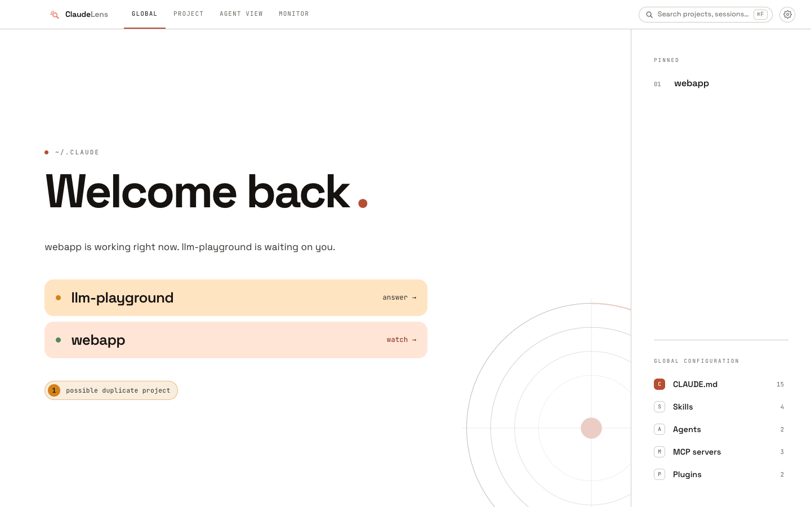
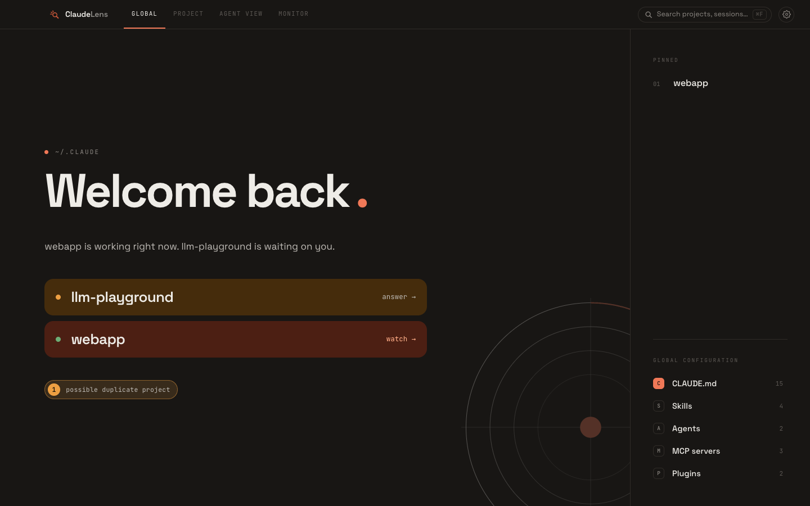
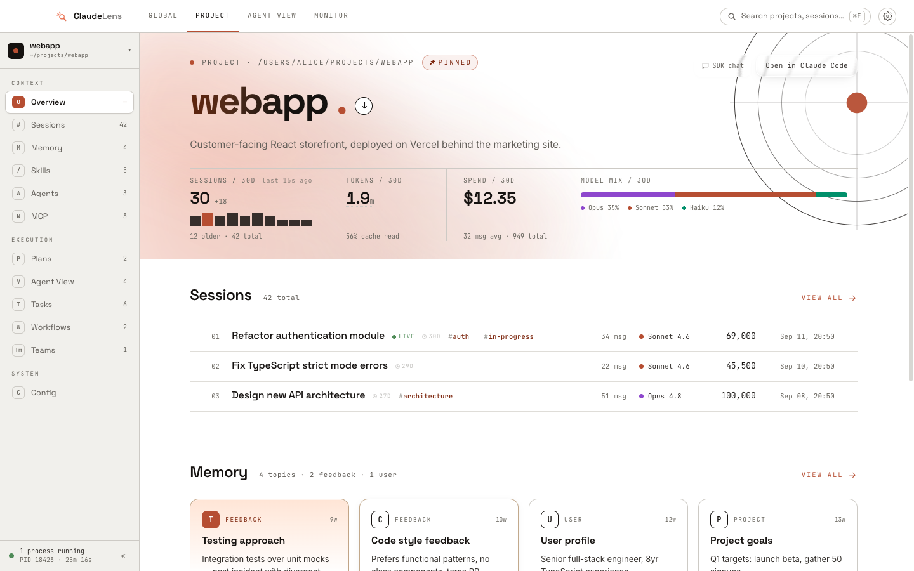
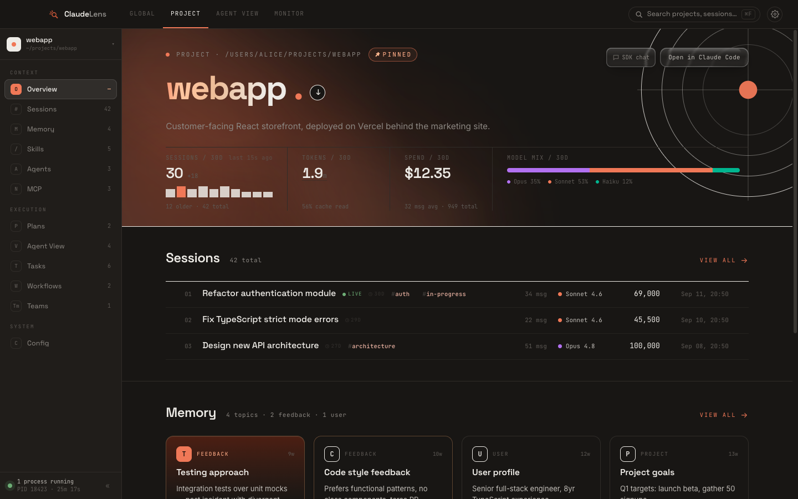
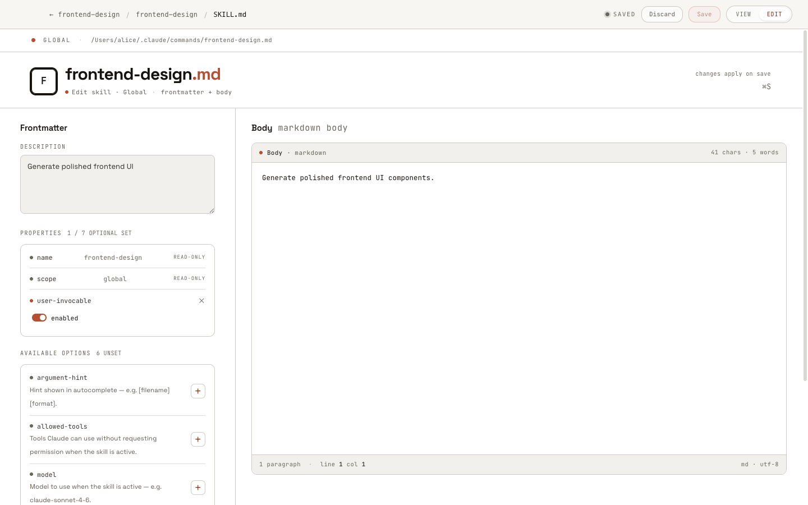
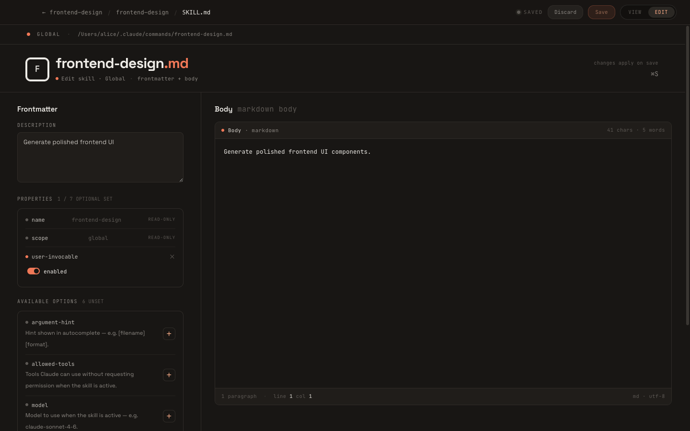
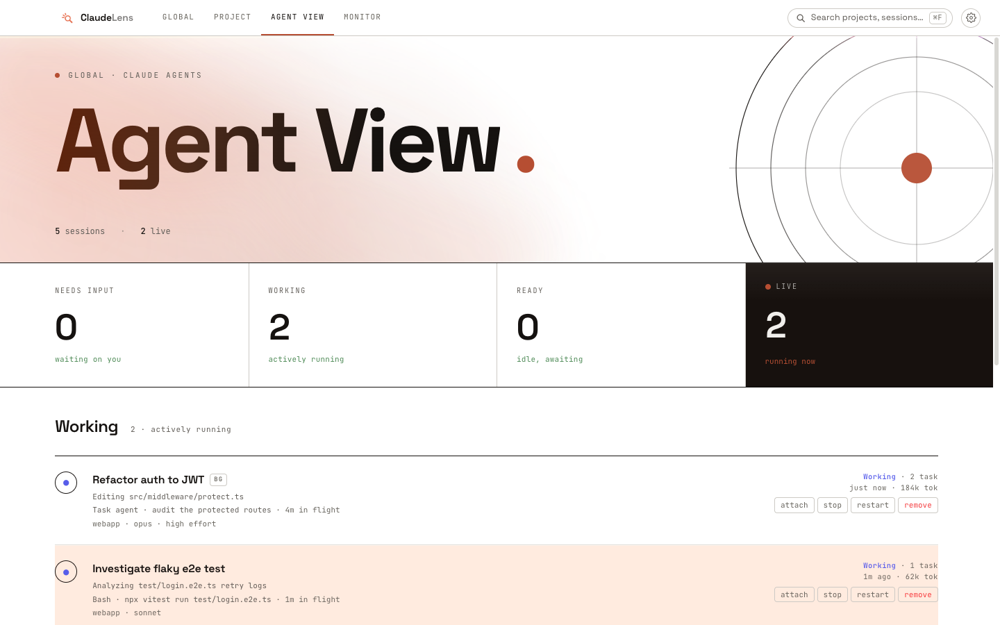
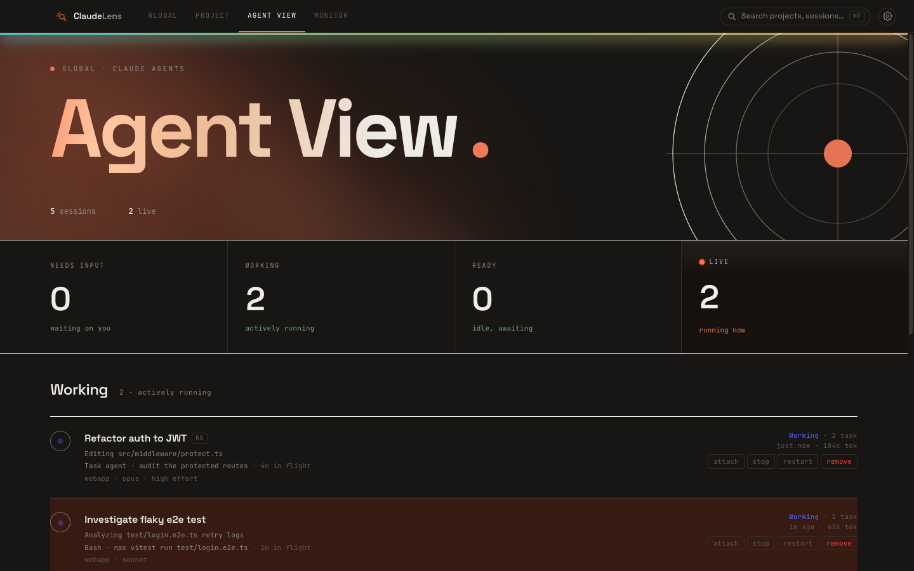

# ClaudeLens

[](https://github.com/giulio333/ClaudeLens/actions/workflows/ci.yml)
[](https://github.com/giulio333/ClaudeLens/releases/latest)
[](https://github.com/giulio333/ClaudeLens/releases)
[](LICENSE)
[](#installation)

A desktop app to explore, manage, and work with your local [Claude Code](https://claude.ai/code) data — macOS, with experimental Linux and Windows support.

If you use Claude Code heavily, you know how opaque `~/.claude/` is. ClaudeLens makes it navigable: read your past sessions, manage memory and CLAUDE.md, edit skills and agents — and pick a conversation back up, either in an embedded terminal or in an in-app chat. Everything stays in sync with `~/.claude/` in real time, so changes you make in the terminal show up instantly, and vice versa.

> 🔒 **Privacy:** your `~/.claude/` data never leaves your device. ClaudeLens sends only anonymous launch telemetry (off in one click) — see [Privacy & Telemetry](#privacy--telemetry).

---

## Installation

### macOS

1. Download the `.dmg` for your Mac (`arm64` for Apple silicon or `x64` for Intel) from the [latest release](https://github.com/giulio333/ClaudeLens/releases/latest).
2. Open the `.dmg` and drag **ClaudeLens** to **Applications**.
3. Because ClaudeLens is not code-signed, macOS may block the first launch. Open Terminal and run:

   ```bash
   xattr -d com.apple.quarantine /Applications/ClaudeLens.app
   ```

4. Open ClaudeLens from Applications. The command is only needed once per installation or update.

You can also try right-clicking ClaudeLens in Finder, choosing **Open**, and confirming the Gatekeeper prompt instead of using Terminal.

### Linux (experimental)

Download the `.AppImage` from the [latest release](https://github.com/giulio333/ClaudeLens/releases/latest) and make it executable with `chmod +x`. Opening a session in a terminal relies on a common terminal emulator being installed (`gnome-terminal`, `konsole`, `xfce4-terminal`, or `xterm`).

### Windows (experimental)

Download and run the `.exe` installer from the [latest release](https://github.com/giulio333/ClaudeLens/releases/latest). Opening a session launches it in a new `cmd` window.

### Verifying your download

The builds are not code-signed, so it's worth checking that what you downloaded is
what CI produced. Every release ships a `checksums.txt` asset:

```bash
# from the folder holding the downloaded file and checksums.txt
shasum -a 256 --check --ignore-missing checksums.txt
```

Each binary also carries a [build provenance attestation](https://docs.github.com/actions/security-guides/using-artifact-attestations),
a signed statement that it came out of this repository's release workflow:

```bash
gh attestation verify ClaudeLens-2.2.0-arm64.dmg --repo giulio333/ClaudeLens
```

### Requirements

- macOS 12 Monterey or later, or Linux / Windows (experimental)
- [Claude Code](https://claude.ai/code) installed and used at least once (so `~/.claude/` exists)

### Updates

ClaudeLens checks the [Releases](https://github.com/giulio333/ClaudeLens/releases) page at launch and shows a small notice when a newer version is available (you can skip a version, and re-check anytime from **Settings → General**). There is no auto-install — the app isn't code-signed, so updating means downloading the new build from the release page and repeating the quarantine step above on macOS.

---

## Screenshots

<table>
  <tr>
    <td align="center"><sub><b>Global Home — Light</b></sub></td>
    <td align="center"><sub><b>Global Home — Dark</b></sub></td>
  </tr>
  <tr>
    <td align="center">
      
    </td>
    <td align="center">
      
    </td>
  </tr>
  <tr>
    <td align="center"><sub><b>Project Overview — Light</b></sub></td>
    <td align="center"><sub><b>Project Overview — Dark</b></sub></td>
  </tr>
  <tr>
    <td align="center">
      
    </td>
    <td align="center">
      
    </td>
  </tr>
  <tr>
    <td align="center"><sub><b>Skill Editor — Light</b></sub></td>
    <td align="center"><sub><b>Skill Editor — Dark</b></sub></td>
  </tr>
  <tr>
    <td align="center">
      
    </td>
    <td align="center">
      
    </td>
  </tr>
  <tr>
    <td align="center"><sub><b>Agent View — Light</b></sub></td>
    <td align="center"><sub><b>Agent View — Dark</b></sub></td>
  </tr>
  <tr>
    <td align="center">
      
    </td>
    <td align="center">
      
    </td>
  </tr>
</table>

---

## Features

### Explore

- **Projects & sessions** — every project from `~/.claude/projects/` in one sidebar, with token usage and cost per project and per session. Open any session to replay the full conversation: messages, thinking blocks, and tool calls rendered for what they are (code diffs, terminal output, web results, sub-agent transcripts).
- **Analytics** — token and cost trends across your history.
- **Memory** — read and edit memory topics with full CRUD, kept in the exact `MEMORY.md` + topic-file format Claude Code expects, with a warning when the index grows large enough to risk truncation.
- **CLAUDE.md & rules** — the complete instruction hierarchy active for a project (global → project → local → subdir) plus conditional `.claude/rules/`.
- **Skills, agents, plugins & MCP** — browse global and per-project skills, agents, installed plugins, and MCP servers; create or edit skills and agents straight from the UI.
- **Plans & tasks** — plan-mode plans (filterable, searchable, editable) and the tasks Claude creates during sessions, grouped per session.

### Work

- **Embedded terminal** — pick up any session in a real terminal inside the app, side by side with its read-only Lens view.
- **In-app chat** — continue a conversation through the Claude Agent SDK without leaving ClaudeLens: streaming replies, native slash commands, and interactive tool approvals (Allow / Always / Deny). Chats persist to the same transcript files as the terminal, so the two are interchangeable.

### Monitor

- **Live Monitor** _(experimental)_ — real-time view of active Claude processes: status (idle / thinking / busy), a sliding activity chart, tool-frequency breakdown, and elapsed timer.
- **Duplicate projects** — detect project folders that point to the same directory and merge their history and memory.

Everything updates live: any change under `~/.claude/` while you work in the terminal is reflected immediately, and vice versa.

---

## Build from source

```bash
npm install
npm run dev              # Vite dev server + Electron
npm run electron:build   # Generate distributable DMG
```

---

## Known limitations

- The embedded terminal and in-app chat require the `claude` CLI installed and in `PATH`
- Session list is not paginated — may be slow with very large histories (500+ sessions)
- No automatic install of updates — the app notifies you of new releases, but the download is manual (see Updates above)
- App is not code-signed (see installation note above)
- On Windows, the Live Monitor and background agents are not yet supported (they rely on Unix process tooling); browsing sessions, memory, CLAUDE.md, and opening sessions in a terminal all work

---

## Privacy & Telemetry

ClaudeLens is local-first: the Claude Code data it reads (under `~/.claude/`)
**never leaves your device**.

The app sends a small amount of **anonymous** usage telemetry via
[Aptabase](https://aptabase.com) (EU) — app launch/exit (with time spent), which
sections you open, and a few feature actions (new chat, export, terminal,
delete), plus your app version, OS, and language. It **never** collects your
sessions, prompts, files, paths, or identity. This helps us understand how
ClaudeLens is used and on which platforms.

Telemetry is on by default and can be turned off anytime in
**Settings → Privacy**. Full details: **[PRIVACY.md](PRIVACY.md)**.

---

## Contributing

Bug reports, feature requests, and pull requests are welcome.

- **Found a bug or want a feature?** [Open an issue](https://github.com/giulio333/ClaudeLens/issues/new/choose) — the templates ask for the few details triage needs.
- **Question or rough idea?** [Discussions](https://github.com/giulio333/ClaudeLens/discussions) is the better place.
- **Want to send a patch?** [CONTRIBUTING.md](CONTRIBUTING.md) covers setup, scripts, and conventions; the architecture is documented in [CLAUDE.md](CLAUDE.md).
- **Found a vulnerability?** Please report it privately — see [SECURITY.md](SECURITY.md).

Participation is covered by our [Code of Conduct](CODE_OF_CONDUCT.md). Release-by-release notes live in [CHANGELOG.md](CHANGELOG.md).

---

## License

[MIT](LICENSE)
